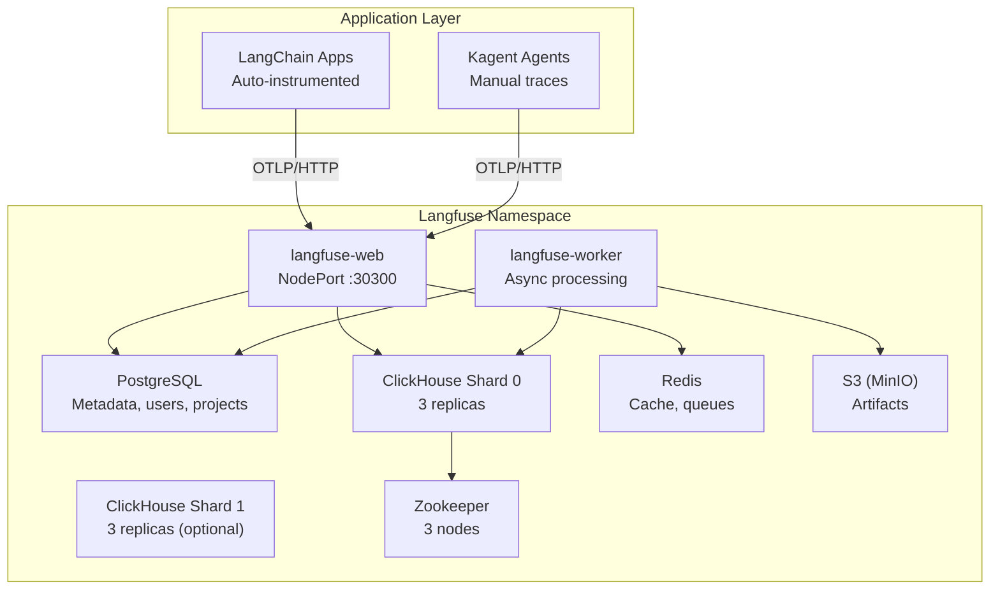
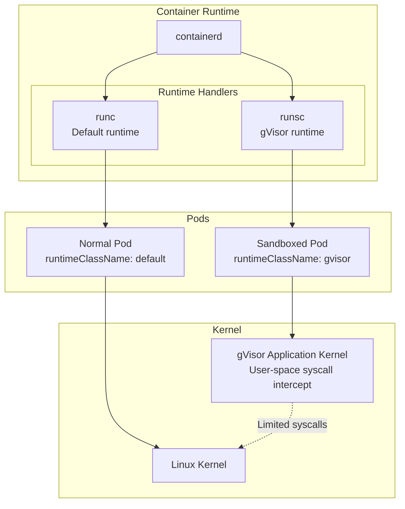

# System Architecture

Detailed technical architecture of the Trotman Enterprises ML Lab.

## Infrastructure Stack

### Physical Layer

```
┌─────────────────────────────────────────────────────────────────┐
│ IBM System x 3650 M4 (Control Host)                            │
│ ├─ 2x Intel Xeon E5-2667 v2 (8C/16T @ 3.30GHz) = 16C/32T     │
│ ├─ 128GB DDR3 ECC RAM (55GB free for VM expansion)            │
│ ├─ VMware ESXi 8.0.3 (IP: 192.168.1.128)                      │
│ └─ IMM2 Remote Management (IP: 192.168.1.200)                 │
└─────────────────────────────────────────────────────────────────┘

┌─────────────────────────────────────────────────────────────────┐
│ IBM System x 3550 M4 (Worker Host)                             │
│ ├─ 2x Intel Xeon E5-2667 v2 (8C/16T @ 3.30GHz) = 16C/32T     │
│ ├─ 335GB DDR3 ECC RAM (277GB free, worker VM expanded)        │
│ ├─ VMware ESXi 8.0.3 (IP: 192.168.1.198)                      │
│ └─ IMM2 Remote Management (IP: 192.168.1.199)                 │
└─────────────────────────────────────────────────────────────────┘
```

### Virtualization Layer

```
┌─────────────────────────────────────────────────────────────────┐
│ k8s-control VM (on 3650 M4)                                     │
│ ├─ OS: AlmaLinux 9.7 (RHEL-compatible)                         │
│ ├─ Resources: 62GB RAM, 16 vCPU, 1TB /models disk              │
│ ├─ Role: Small/medium ML models + LiteLLM orchestration        │
│ ├─ IP: 192.168.1.130                                           │
│ └─ Services: 5 llama.cpp models, LiteLLM proxy, k3s (minimal) │
└─────────────────────────────────────────────────────────────────┘

┌─────────────────────────────────────────────────────────────────┐
│ k8s-worker VM (on 3550 M4)                                      │
│ ├─ OS: AlmaLinux 9.7 (RHEL-compatible)                         │
│ ├─ Resources: 256GB RAM, 16 vCPU, 1TB /models disk             │
│ ├─ Role: Large ML model inference (70B+ parameter models)      │
│ ├─ IP: 192.168.1.131                                           │
│ └─ Services: 4 llama.cpp large models (Llama 70B, Qwen 72B...) │
└─────────────────────────────────────────────────────────────────┘
```

### Container Runtime

```
┌─────────────────────────────────────────────────────────────────┐
│ k3s v1.34.6+k3s1                                                │
│ ├─ Embedded containerd (managed by k3s)                        │
│ ├─ Default runtime: runc (io.containerd.runc.v2)               │
│ ├─ Sandbox runtime: runsc (io.containerd.runsc.v1)             │
│ ├─ CNI: Flannel (embedded)                                     │
│ ├─ Ingress: Traefik (embedded)                                 │
│ └─ Storage: local-path-provisioner (embedded)                  │
└─────────────────────────────────────────────────────────────────┘
```

## Network Architecture

### Cluster Networking

```
192.168.1.0/24 (Home Network)
├─ 192.168.1.254 (Gateway/Router)
├─ 192.168.1.128 (ESXi 3650)
│  └─ 192.168.1.130 (k8s-control VM)
├─ 192.168.1.198 (ESXi 3550)
│  └─ 192.168.1.131 (k8s-worker VM)
├─ 192.168.1.200 (IMM2 3650)
└─ 192.168.1.199 (IMM2 3550)

Pod Network: 10.42.0.0/16 (Flannel)
Service Network: 10.43.0.0/16 (k3s default)
```

### Service Exposure

| Service | Type | Port | Access |
|---------|------|------|--------|
| **LiteLLM Proxy (Unified API)** | systemd | 4000/TCP | http://192.168.1.130:4000 |
| Hermes 2 Pro 8B | systemd | 30704/TCP | http://192.168.1.130:30704 |
| Qwen 2.5 14B | systemd | 30705/TCP | http://192.168.1.130:30705 |
| Granite 3.0 8B | systemd | 30709/TCP | http://192.168.1.130:30709 |
| Functionary Small | systemd | 30706/TCP | http://192.168.1.130:30706 |
| Qwen 2.5 32B | systemd | 30703/TCP | http://192.168.1.130:30703 |
| Llama 3.1 70B | systemd | 30700/TCP | http://192.168.1.131:30700 |
| Qwen 2.5 72B | systemd | 30701/TCP | http://192.168.1.131:30701 |
| Mixtral 8x7B | systemd | 30707/TCP | http://192.168.1.131:30707 |
| Mixtral 8x22B | systemd | 30708/TCP | http://192.168.1.131:30708 |
| Langfuse Web | NodePort | 30300/TCP | http://192.168.1.130:30300 |

## ML Model Serving Architecture

### Distributed llama.cpp + LiteLLM Setup

The ML inference platform uses a distributed architecture with llama.cpp-python for model serving and LiteLLM as a unified API gateway.

```
┌──────────────────────────────────────────────────────────────────────┐
│ User Applications                                                    │
└────────────────────────┬─────────────────────────────────────────────┘
                         │
                         ▼
         ┌───────────────────────────────────┐
         │ LiteLLM Proxy (Control Node)      │
         │ http://192.168.1.130:4000/v1      │
         │ OpenAI-compatible API             │
         └───────────┬───────────────────────┘
                     │
         ┌───────────┴────────────┬─────────────────────┐
         │                        │                     │
         ▼                        ▼                     ▼
┌─────────────────┐    ┌──────────────────┐   ┌────────────────┐
│ Control Node    │    │ Worker Node      │   │ Cloud APIs     │
│ Small Models    │    │ Large Models     │   │                │
├─────────────────┤    ├──────────────────┤   ├────────────────┤
│ Hermes 8B       │    │ Llama 70B        │   │ Claude Sonnet  │
│ Qwen 14B        │    │ Qwen 72B         │   │ Claude Haiku   │
│ Granite 8B      │    │ Mixtral 8x7B     │   │ GPT-4o         │
│ Functionary     │    │ Mixtral 8x22B    │   │ GPT-4o Mini    │
│ Qwen 32B        │    │                  │   │ Gemini 2.0     │
│                 │    │                  │   │                │
│ ~42GB RAM used  │    │ ~196GB RAM used  │   │                │
└─────────────────┘    └──────────────────┘   └────────────────┘
```

### Model Distribution Strategy

**Control Node (192.168.1.130) - 62GB RAM:**
- **Purpose**: Fast-response small/medium models + API orchestration
- **Models**: 5 local models (8B-32B parameter range)
- **Memory**: ~42GB used, 20GB free
- **Response time**: <500ms first token for most queries

**Worker Node (192.168.1.131) - 256GB RAM:**
- **Purpose**: High-quality large model inference
- **Models**: 4 large models (70B+ parameter range)
- **Memory**: ~196GB when all loaded, 60GB free
- **Response time**: 1-3s first token, maximum quality

**Cloud Providers:**
- **Purpose**: Fallback, vision models, ultra-high quality
- **Models**: Claude 3.5 (Sonnet/Haiku), GPT-4o, Gemini 2.0
- **Cost**: Pay-per-token, used selectively

### Technology Stack

**Model Runtime:**
- **llama.cpp-python**: Python bindings for llama.cpp
- **GGUF Q4_K_M quantization**: 4-bit quantization, ~40GB for 70B models
- **Systemd services**: Production deployment, auto-restart on failure
- **CPU inference**: 8-15 tokens/sec on Xeon E5-2690 processors

**API Gateway:**
- **LiteLLM**: Unified OpenAI-compatible API for all models
- **Smart routing**: Route by model capability and size
- **Load balancing**: Round-robin across endpoints
- **Failover**: Automatic fallback to cloud if local fails

**Monitoring:**
- **Live dashboard**: Real-time deployment status
- **Systemd journald**: Centralized logging
- **Resource tracking**: Memory, CPU, tokens/sec metrics

See [`docs/DISTRIBUTED_ARCHITECTURE.md`](docs/DISTRIBUTED_ARCHITECTURE.md) for detailed deployment guide.

## Component Architecture

### 1. Observability (Langfuse)



**Data Flow:**
1. LangChain SDK auto-instruments all LLM calls
2. Traces sent to Langfuse via OTLP
3. Metadata stored in PostgreSQL (users, projects, prompts)
4. Trace data stored in ClickHouse (high-volume time-series)
5. Redis caches recent queries
6. S3 stores large artifacts (datasets, fine-tuning data)

### 2. Code Sandboxing (gVisor)



**gVisor RuntimeClass:**
```yaml
apiVersion: node.k8s.io/v1
kind: RuntimeClass
metadata:
  name: gvisor
handler: runsc
```

**Usage:**
```yaml
spec:
  runtimeClassName: gvisor  # Adds application kernel isolation
```

## Data Persistence

### Storage Classes

```
┌─────────────────────────────────────────────────────────────────┐
│ local-path (k3s default)                                        │
│ ├─ Type: hostPath with dynamic provisioning                    │
│ ├─ Location: /var/lib/rancher/k3s/storage/                    │
│ ├─ Used by: PostgreSQL, ClickHouse, Redis, models             │
│ └─ Limitations: Node-affinity (not portable across nodes)     │
└─────────────────────────────────────────────────────────────────┘
```

### Persistent Volumes

| Component | PVC Name | Size | Mount Path |
|-----------|----------|------|------------|
| PostgreSQL | langfuse-postgresql | 8Gi | /bitnami/postgresql |
| ClickHouse Shard 0-0 | data-langfuse-clickhouse-shard0-0 | 8Gi | /bitnami/clickhouse |
| ClickHouse Shard 0-1 | data-langfuse-clickhouse-shard0-1 | 8Gi | /bitnami/clickhouse |
| ClickHouse Shard 0-2 | data-langfuse-clickhouse-shard0-2 | 8Gi | /bitnami/clickhouse |
| Redis | redis-data-langfuse-redis-primary-0 | 8Gi | /data |
| Zookeeper 0 | data-langfuse-zookeeper-0 | 8Gi | /bitnami/zookeeper |
| Zookeeper 1 | data-langfuse-zookeeper-1 | 8Gi | /bitnami/zookeeper |
| Zookeeper 2 | data-langfuse-zookeeper-2 | 8Gi | /bitnami/zookeeper |

## Security Architecture

### Authentication & Authorization

```
┌─────────────────────────────────────────────────────────────────┐
│ Kubernetes RBAC                                                 │
│ ├─ ServiceAccounts per namespace                               │
│ ├─ Kagent: scoped RBAC (read cluster, write kagent ns)        │
│ ├─ KServe: cluster-admin for CRD management                   │
│ └─ Langfuse: namespace-scoped (langfuse only)                 │
└─────────────────────────────────────────────────────────────────┘

┌─────────────────────────────────────────────────────────────────┐
│ API Authentication                                              │
│ ├─ vLLM: No auth (internal network only)                      │
│ ├─ Ollama: No auth (cluster-internal only)                    │
│ ├─ Anthropic: API key in Kubernetes Secret                    │
│ └─ Langfuse: NextAuth.js (email/password, OAuth)              │
└─────────────────────────────────────────────────────────────────┘
```

### Network Policies

Currently: **Open** (systemd services on host network, no firewall)

Future considerations:
- Add firewall rules to restrict model endpoints to LiteLLM proxy only
- Isolate Langfuse data plane from public access
- Implement VPN for remote model access

### Secrets Management

**LiteLLM API Keys (Environment variables):**
```bash
LITELLM_MASTER_KEY=sk-trotman-litellm-2026
ANTHROPIC_API_KEY=sk-ant-api03-...
OPENAI_API_KEY=sk-...
GEMINI_API_KEY=...
```

**Langfuse (Kubernetes secrets):**
```yaml
langfuse/langfuse-secrets:
  NEXTAUTH_SECRET: <auto-generated>
  SALT: <auto-generated>
```

## Performance Characteristics

### Resource Utilization (Idle)

| Node | CPU Usage | Memory Usage | Pods |
|------|-----------|--------------|------|
| k8s-control | ~2 cores (12.5%) | ~18GB (28%) | 35 |
| k8s-worker | ~1 core (6.25%) | ~12GB (18%) | 17 |

### llama.cpp Performance (on Xeon E5-2667 v2 @ 3.30GHz)

```
Small Models (8B-14B parameters):
├─ First token latency: 100-300ms
├─ Throughput: 12-18 tokens/sec
├─ Memory footprint: 4-9GB
└─ CPU threads: 8 (n_threads=8)

Medium Models (32B parameters):
├─ First token latency: 400-600ms
├─ Throughput: 8-12 tokens/sec
├─ Memory footprint: ~19GB
└─ CPU threads: 8

Large Models (70B+ parameters):
├─ First token latency: 1-2 seconds
├─ Throughput: 6-10 tokens/sec
├─ Memory footprint: 40-87GB
└─ CPU threads: 16 (n_threads=16)

Quantization: Q4_K_M (4-bit mixed precision)
Context window: 2048-4096 tokens
Runtime: llama.cpp-python with systemd
```

### Langfuse Data Volume

```
Expected trace volume: ~100/day (development)
├─ PostgreSQL: <100MB/month (metadata)
├─ ClickHouse: ~500MB/month (traces)
└─ Redis: ~50MB (cache)

Production estimate: ~10K traces/day
├─ PostgreSQL: ~1GB/month
├─ ClickHouse: ~50GB/month
└─ Retention: 400 days (configurable)
```

## Scaling Strategy

### Horizontal Scaling

**Current:** Single replica for all services

**Future:** Scale-out targets
- llama.cpp: Multiple model instances on different ports (already deployed)
- LiteLLM: Add load balancing across multiple endpoints
- Langfuse workers: 3-5 replicas for async processing
- ClickHouse: Add shard 1 for >100K traces/day

### Vertical Scaling

**Implemented:**
- ✅ Worker VM expanded to 256GB RAM (from 62GB)
- ✅ Distributed models across control (62GB) and worker (256GB) nodes

**Future Options:**
- Expand control VM to 100GB (ESXi host has 55GB free)
- Add more CPUs if CPU becomes bottleneck

### GPU Acceleration

**Future:** Pass-through NVIDIA Tesla P40 (12GB VRAM)
- ESXi supports GPU passthrough (vDGA)
- Target: 40-60 tokens/sec with FP16 models
- Requires: PCIe slot, power budget, driver setup

## Disaster Recovery

### Backup Strategy

**Not yet implemented**

Recommended:
```bash
# PostgreSQL (Langfuse metadata)
pg_dump -h langfuse-postgresql -U postgres langfuse > langfuse-backup.sql

# ClickHouse (trace data)
clickhouse-client --query "BACKUP DATABASE default TO Disk('backups', 'backup.zip')"

# Kubernetes manifests
kubectl get all --all-namespaces -o yaml > cluster-backup.yaml

# Model files
rsync -av /models/ backup-server:/models-backup/
```

### Recovery Plan

1. **VM failure:** Rebuild from AlmaLinux ISO + k3s install script
2. **k3s failure:** `systemctl restart k3s`
3. **Database corruption:** Restore from pg_dump/ClickHouse backup
4. **Model loss:** Re-download from Hugging Face
5. **Config loss:** Re-apply from Git repository

## Monitoring & Alerting

### Current State

**No infrastructure monitoring** (Prometheus/Grafana not deployed)

### Available Metrics

- Langfuse UI: Trace latency, token usage, cost
- LiteLLM: Request logs, routing decisions, failover events
- systemd journald: Model service logs, startup/restart events
- Custom dashboard: scripts/deployment-status.sh (live deployment monitoring)

### Future Integration

```
Prometheus → Grafana
├─ Node metrics (node-exporter)
├─ llama.cpp model metrics (systemd status, memory usage)
├─ LiteLLM metrics (requests/sec, latency, model selection)
└─ Langfuse metrics (custom exporter)

Alerting:
├─ llama.cpp service down (>5min)
├─ LiteLLM proxy unreachable
├─ Model OOM events (systemd journal)
├─ Langfuse PostgreSQL storage >80%
└─ Node CPU >90% (sustained)
```

## Cost Analysis

### Hardware (One-time)

| Item | Cost | Notes |
|------|------|-------|
| IBM System x 3650 M4 | $500 | Used server market |
| IBM System x 3550 M4 | $400 | Used server market |
| RAM upgrades | $200 | 256GB DDR3 ECC |
| Network switch | $50 | Gigabit switch |
| **Total** | **$1,150** | One-time investment |

### Operating Costs (Monthly)

| Item | Cost | Notes |
|------|------|-------|
| Electricity (~400W @ $0.15/kWh) | $43 | 24/7 operation |
| Internet | $0 | Home network |
| Anthropic API (minimal) | $5 | ~1M tokens/month |
| **Total** | **$48/month** | **$576/year** |

### Cloud Comparison (Equivalent)

| Provider | Monthly Cost | Notes |
|----------|--------------|-------|
| AWS EKS (2x m5.4xlarge) | ~$500 | 16 vCPU, 64GB RAM each |
| LangSmith Cloud (10K traces) | $39 | Self-hosted = $0 |
| GPU instances (optional) | +$500 | Self-hosted = future investment |
| **Total** | **$1,000+/month** | **vs $48/month** |

**Break-even:** ~14 months of self-hosting = cloud costs

## Technology Choices

### Why k3s over k8s?

- **Simplicity:** Single binary, no external dependencies
- **Resource efficiency:** Lower memory footprint (~500MB vs 2GB)
- **Built-in components:** Traefik, local-path-provisioner, CoreDNS
- **Production-ready:** CNCF certified Kubernetes distribution

### Why llama.cpp over vLLM?

- **CPU support:** vLLM doesn't support Linux CPU inference (GPU/macOS only)
- **Stability:** Mature, battle-tested C++ codebase vs experimental Python
- **Memory efficiency:** GGUF quantization (Q4_K_M) reduces 70B models to 40GB
- **Simplicity:** Single binary, no complex dependencies or orchestration needed
- **OpenAI API:** llama.cpp-python provides compatible REST API via `-m llama_cpp.server`
- **Production ready:** Systemd services for reliability, no k8s complexity

### Why Langfuse over LangSmith?

- **Cost:** $0 vs $2,500+/month at scale
- **Data ownership:** Full SQL access, no vendor lock-in
- **Open source:** MIT license, active community
- **Framework-agnostic:** Works with any LLM framework

### Why LiteLLM for orchestration?

- **Unified API:** Single OpenAI-compatible endpoint for 15 different models
- **Multi-provider:** Routes to local llama.cpp, cloud APIs (Claude, GPT-4o, Gemini)
- **Smart routing:** Model groups (small/medium/large) for automatic selection
- **Load balancing:** Round-robin across multiple endpoints
- **Failover:** Automatic fallback to cloud if local models unavailable
- **Zero complexity:** Python proxy, no Kubernetes operators or CRDs needed

## Future Architecture Evolution

### Phase 2: GPU Acceleration (Q3 2026)

```
Add: NVIDIA GPU (T4 or RTX 4090)
├─ ESXi GPU passthrough to k8s-worker VM
├─ vLLM with CUDA support (GPU workloads only)
├─ Expected: 40-80 tok/s (4-8x improvement over CPU)
├─ Larger models: Llama 3.1 70B full precision
└─ Keep llama.cpp for CPU fallback/redundancy
```

### Phase 3: Multi-Cluster (Q4 2026)

```
Add: 3rd node (edge cluster)
├─ Federated learning across sites
├─ KServe multi-cluster routing
└─ Disaster recovery (geo-redundancy)
```

### Phase 4: Production Hardening (2027)

```
Add:
├─ Istio service mesh (mTLS, traffic policies)
├─ ArgoCD for GitOps (declarative deployments)
├─ Prometheus + Grafana (full observability)
├─ Velero backups (automated snapshots)
└─ NetworkPolicies (zero-trust networking)
```
