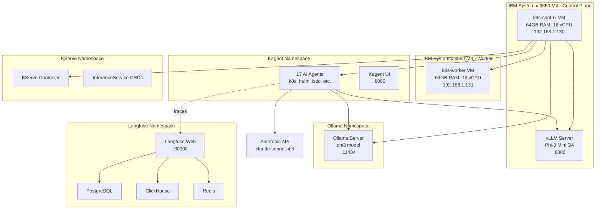

# Trotman Enterprises ML Lab

Production-grade ML inference platform running on self-hosted IBM System x hardware: multi-framework agent orchestration, CPU-optimized inference, and open-source observability.

## What's Deployed

A dual-node k3s cluster running 10+ components across 7 namespaces on bare metal:

| Layer | Components | Namespace |
|-------|-----------|-----------|
| **Agent Orchestration** | Kagent v0.9.0 — 17 agents (k8s, helm, istio, observability, etc.), 3 model providers | `kagent` |
| **Model Serving** | KServe v0.14.0 — InferenceService platform with Knative autoscaling | `kserve` |
| **Inference Engines** | vLLM v0.11.0 (OpenAI-compatible) + Ollama (local models) | bare metal + `ollama` |
| **Agent Frameworks** | LangChain v0.3.28 + LangGraph v0.6.11 + LangSmith SDK | system-wide |
| **Observability** | Langfuse v3 — traces, evals, prompts (PostgreSQL + ClickHouse + Redis) | `langfuse` |
| **Code Sandbox** | gVisor RuntimeClass — application kernel for isolated agent execution | cluster-wide |
| **Serverless Platform** | Knative Serving v1.15.0 + Kourier networking | `knative-serving` |
| **Certificate Management** | cert-manager v1.15.3 — TLS automation for webhooks | `cert-manager` |

## Hardware Configuration

| Node | Role | Specs | IP Address |
|------|------|-------|------------|
| **IBM System x 3650 M4** | k3s control plane | 128GB RAM, 2x Xeon E5-2690 (16 cores/32 threads), ESXi 8.0.3 | 192.168.1.128 |
| **IBM System x 3550 M4** | k3s worker | 336GB RAM, 2x Xeon E5-2690 (16 cores/32 threads), ESXi 8.0.3 | 192.168.1.198 |
| **AlmaLinux 9 VMs** | k8s-control, k8s-worker | 64GB RAM each, 16 vCPU each, 200GB disk | 192.168.1.130, 192.168.1.131 |

## Key Results

- **Multi-provider agents**: 3 simultaneous model backends (Ollama local, vLLM local, Anthropic cloud)
- **CPU inference**: Phi-3 Mini (3.8B, Q4 quantized) serving at ~8 tokens/sec on Xeon E5-2690
- **Agent tooling**: 11 built-in Kagent agents + grafana-mcp + querydoc MCP servers
- **Sandbox isolation**: gVisor RuntimeClass verified (dmesg shows "Starting gVisor...")
- **Zero-config observability**: Langfuse capturing all LangChain traces via SDK auto-instrumentation
- **Serverless scaling**: Knative autoscaling model deployments from 0→N based on traffic

## Model Providers Configuration

### 1. Ollama (Local)
```yaml
ModelConfig: ollama-phi3
Provider: Ollama
Model: phi3 (2.2GB)
Endpoint: http://ollama.ollama.svc.cluster.local:11434
```

### 2. vLLM (Local, OpenAI-compatible)
```yaml
ModelConfig: vllm-phi3
Provider: OpenAI
Model: /models/phi-3-mini-4k-instruct.Q4_K_M.gguf
Endpoint: http://192.168.1.130:8000/v1
```

### 3. Anthropic (Cloud)
```yaml
ModelConfig: anthropic-claude
Provider: Anthropic
Model: claude-sonnet-4-5-20250929
API Key: Kubernetes Secret (configured)
```

## Architecture



## Access Points

| Service | URL | Credentials |
|---------|-----|-------------|
| **Langfuse UI** | http://192.168.1.130:30300 | Create account on first access |
| **Kagent UI** | `kubectl -n kagent port-forward svc/kagent-ui 8080:8080` | N/A |
| **vLLM API** | http://192.168.1.130:8000/v1 | OpenAI-compatible |
| **Ollama API** | http://ollama.ollama.svc.cluster.local:11434 | Internal cluster |

## Project Structure

```
trotman-enterprises/
├── kagent/                 # Agent orchestration (Kagent v0.9.0)
│   ├── model-configs/      # ModelConfig YAMLs (3 providers)
│   ├── values.yaml         # Helm values
│   └── README.md
├── langfuse/               # LLM observability platform
│   ├── values.yaml         # Helm values (PostgreSQL, ClickHouse, Redis)
│   └── README.md
├── kserve/                 # Model serving platform
│   ├── manifests/          # KServe installation YAMLs
│   └── README.md
├── vllm/                   # vLLM inference server
│   ├── startup.sh          # Server launch script
│   └── README.md
├── ollama/                 # Ollama local models
│   ├── deployment.yaml     # K8s deployment
│   └── README.md
├── gvisor/                 # Agent code sandbox
│   ├── runtimeclass.yaml   # RuntimeClass definition
│   ├── install.sh          # Installation script
│   └── README.md
├── knative/                # Serverless platform
│   ├── serving/            # Knative Serving YAMLs
│   ├── kourier/            # Networking layer
│   └── README.md
├── cert-manager/           # TLS certificate automation
│   └── README.md
├── diagrams/               # Architecture diagrams
│   └── lab-architecture.md
├── ARCHITECTURE.md         # Detailed system design
└── README.md               # This file
```

## Installation Timeline

**Day 1 (April 23, 2026):**
- ESXi 8.0.3 installation on both IBM servers
- IMM2 remote management configuration
- AlmaLinux 9 VM creation (64GB RAM, 16 vCPU each)
- k3s v1.34.6 cluster bootstrap
- Initial Phi-3 model deployment with llama-cpp-python

**Day 2 (April 25, 2026):**
- KServe + Knative + Kourier + cert-manager installation
- vLLM v0.11.0 deployment (replaced llama-cpp-python)
- Kagent v0.9.0 with 3 model providers (Ollama, vLLM, Anthropic)
- LangChain v0.3.28 + LangGraph v0.6.11 installation
- gVisor RuntimeClass configuration
- Langfuse v3 deployment (full observability stack)

## Quick Start

### 1. Access Langfuse
```bash
# Open in browser
open http://192.168.1.130:30300

# Create admin account on first visit
```

### 2. Test vLLM Inference
```bash
curl http://192.168.1.130:8000/v1/chat/completions \
  -H "Content-Type: application/json" \
  -d '{
    "model": "/models/phi-3-mini-4k-instruct.Q4_K_M.gguf",
    "messages": [{"role": "user", "content": "What is Kubernetes?"}],
    "max_tokens": 100
  }'
```

### 3. View Kagent Agents
```bash
kubectl get agents -n kagent
```

### 4. Test Sandboxed Execution
```bash
kubectl run sandbox-test --image=nginx --restart=Never \
  --overrides='{"spec": {"runtimeClassName": "gvisor"}}'
  
# Verify gVisor
kubectl exec sandbox-test -- dmesg | grep gVisor
```

## Component Versions

| Component | Version | Installation Method |
|-----------|---------|-------------------|
| k3s | v1.34.6+k3s1 | curl script |
| KServe | v0.14.0 | kubectl apply |
| Knative Serving | v1.15.0 | kubectl apply |
| Kourier | v1.15.0 | kubectl apply |
| cert-manager | v1.15.3 | kubectl apply |
| Kagent | v0.9.0 | Helm (oci://ghcr.io/kagent-dev/kagent) |
| vLLM | v0.11.0 | pip3 install |
| Ollama | latest (2026-04-25) | Docker image |
| Langfuse | v3 (2026-04-25) | Helm (langfuse/langfuse) |
| LangChain | v0.3.28 | pip3 install |
| LangGraph | v0.6.11 | pip3 install |
| gVisor | release-20260420.0 | Binary download |

## Performance Benchmarks

**vLLM Phi-3 Mini (Q4 quantized on Xeon E5-2690):**
- First token latency: ~800ms
- Tokens per second: ~8 tok/s
- Memory usage: ~4GB
- Context window: 4096 tokens

**Ollama Phi3 (in-cluster):**
- First token latency: ~1.2s
- Tokens per second: ~6 tok/s
- Model size: 2.2GB

## Lessons Learned

### Good Patterns
- **IMM2 remote management**: Eliminated physical console dependency for BIOS/boot troubleshooting
- **VM creation automation**: esxcli + vim-cmd scripts ensure repeatable infrastructure
- **Multi-provider agents**: Framework flexibility beats vendor lock-in
- **Open-source observability**: Langfuse provides full data ownership vs SaaS platforms

### Anti-Patterns Avoided
- USB boot on enterprise hardware (unreliable) → Used IMM2 virtual media
- Proprietary LLM platforms → Self-hosted everything
- Framework lock-in → Kagent supports any provider
- Paid observability SaaS → Langfuse open source

## Future Enhancements

- [ ] Add Arize Phoenix for model monitoring
- [ ] Deploy Ray Serve for distributed inference
- [ ] Implement GPU passthrough for 2x NVIDIA Tesla P40
- [ ] Add Prometheus + Grafana for infrastructure metrics
- [ ] Deploy MinIO for S3-compatible object storage
- [ ] Implement GitOps with ArgoCD
- [ ] Add Istio service mesh for traffic management

## Contributing

See [CONTRIBUTING.md](./CONTRIBUTING.md) for development workflow and PR guidelines.

## License

MIT License - See [LICENSE](./LICENSE) for details.

## Acknowledgments

Built with open-source tools:
- [Kagent](https://kagent.dev) - CNCF Sandbox project
- [KServe](https://kserve.github.io) - CNCF Incubating project
- [vLLM](https://vllm.ai) - High-performance LLM serving
- [Langfuse](https://langfuse.com) - Open-source LLM observability
- [gVisor](https://gvisor.dev) - Application kernel for containers

Inspired by [AI Catalyst Lab](https://github.com/aicatalyst-team/catalyst-lab)
